# Raspberry Pi 4 を用いたオフライン地図表示システムの構築手順

- ローカルネットワーク（LAN）内のWebブラウザから自由にアクセスできるマップホスティングサーバーとして機能するRaspberry Piの環境構築について説明します。
-  具体には、Raspberry Pi 4をWi-Fiアクセスポイント化した上で、オフライン環境（インターネット未接続）においてノートPCやスマートフォンからRaspberry Pi 4のWi-Fiネットワークにアクセスして、Webブラウザ（MapLibre GL JS）で最適化ベクトルタイル（PMTiles、16GB）を表示します。
- 以下のドキュメントを参考にRaspberry Piの環境構築を行っています。
    - UNVT Portable
        - https://github.com/unvt/portable
    - Raspberry Pi WiFiアクセスポイント+クライアント同時使用
        - https://www.mikan-tech.net/entry/raspi-wifi-ap-sta

# 必要な機材
- ノートPC
- スマートフォン
- [Raspberry Pi 4 Model B 8GB 14,020円 税込](https://akizukidenshi.com/catalog/g/g115450/)
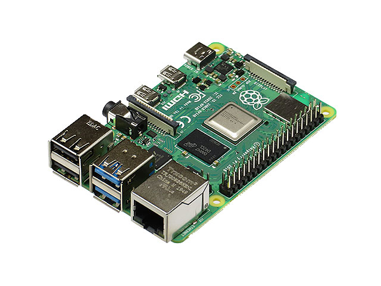

- [Pi4Case (Red/White) (ラズパイ4公式ケース) 800円 税込](https://akizukidenshi.com/catalog/g/g114779/)
- [マイクロSDカード64GB 1,100円 税込](https://akizukidenshi.com/catalog/g/g115971/)
- [SDカードリーダー 2,279円 税込](https://www.amazon.co.jp/dp/B0CKBY3Q11)
- [モバイルバッテリー 2,990円 税込](https://www.amazon.co.jp/dp/B019GNUT0C)

# ノートPCの仕様
- マウスコンピューター（DAIV 4N-KK）
- OS : Windows 10 Pro 64ビット
- CPU : インテル Core i7-10510U
- メモリ : 16GB
- SSD : 512GB（空き容量350GB）

# Raspberry Piの環境構築
## ノートPCにRaspberry Pi Imagerをインストール
- 下記からRaspberry Pi ImagerをダウンロードしてノートPCにインストールします。
https://www.raspberrypi.com/software/
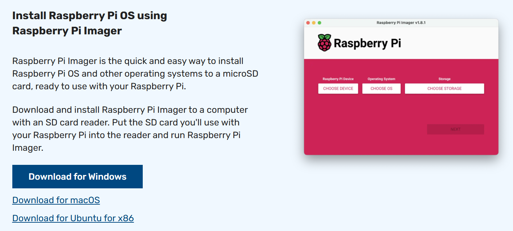

## microSDカードのフォーマット
- Raspberry Pi Imagerを起動して、microSDカードをフォーマットします。
- microSDカードは、SDカードリーダーと付属のアダプタを用いて、PCに接続します。
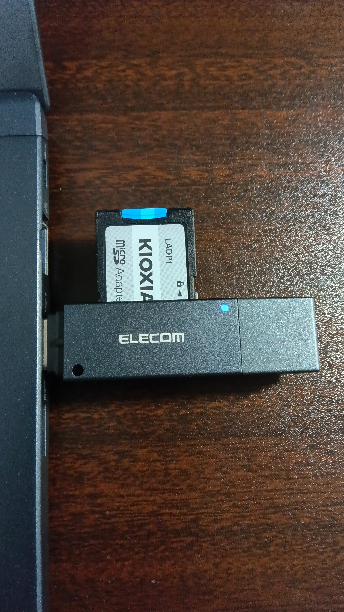

- OSにEraseを選択、ストレージにmicroSDカードを選択して、次へをクリックします。
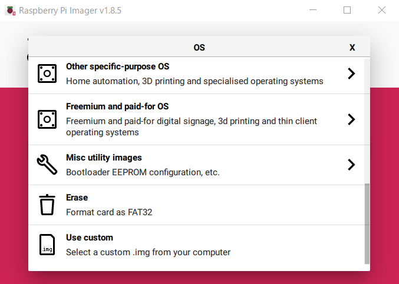
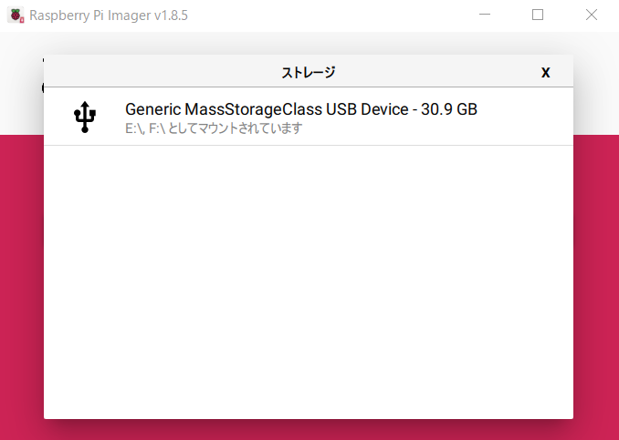
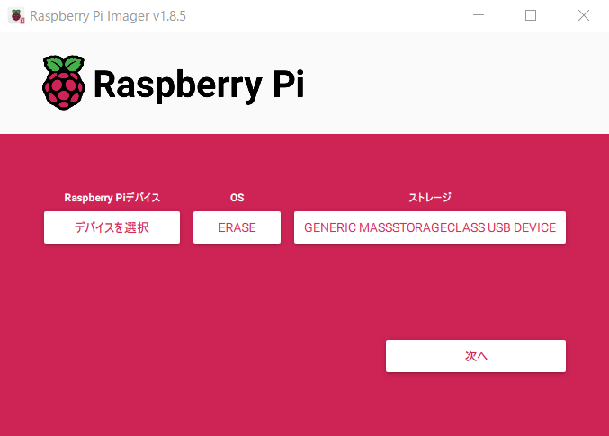

## microSDカードにRaspberry Pi OS(32bit)を書き込む
**※ホスト名、ユーザ名、パスワード、Wi-Fi、SSHの設定も行います。**
- Raspberry Pi Imagerを用いて、microSDカードに、Raspberry Pi OS(32bit)を書き込みます。
- Raspberry Pi OS(32bit)の書き込み前に、ホスト名、ユーザ名、パスワード、Wi-Fi、SSHの設定を行います。
- Shift + Ctrl + Xで設定画面が開きます。
- ホスト名を「raspberrypi.local」から「unvtportable.local」に変更
- ユーザー名を「pi」、パスワードを任意の値に設定します。
- 作業環境に応じてWi-Fi設定を行います。
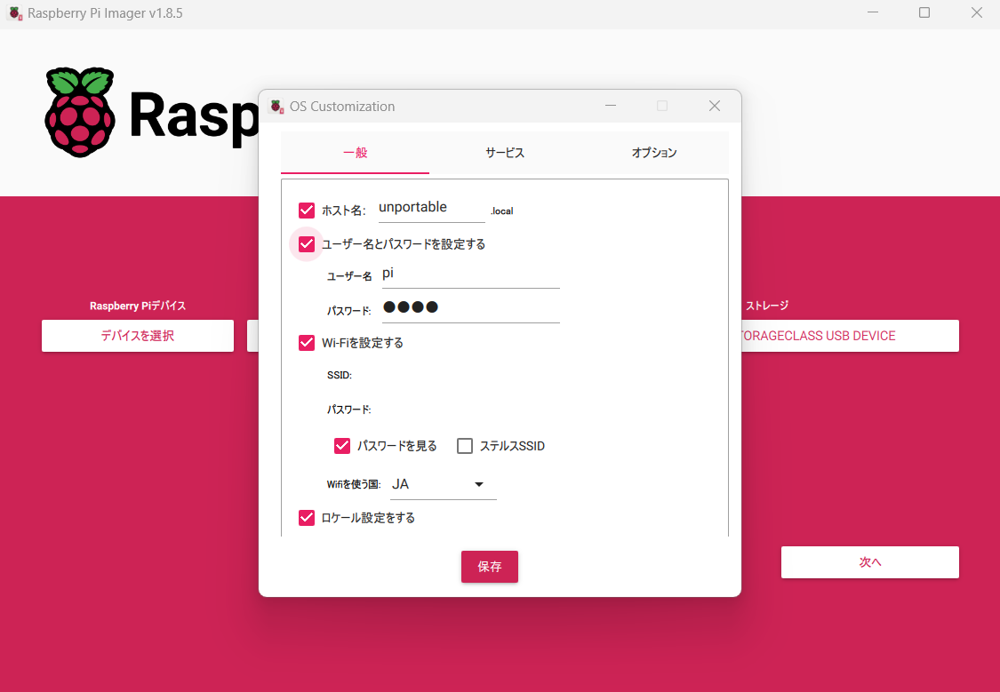

- ロケールを設定します。
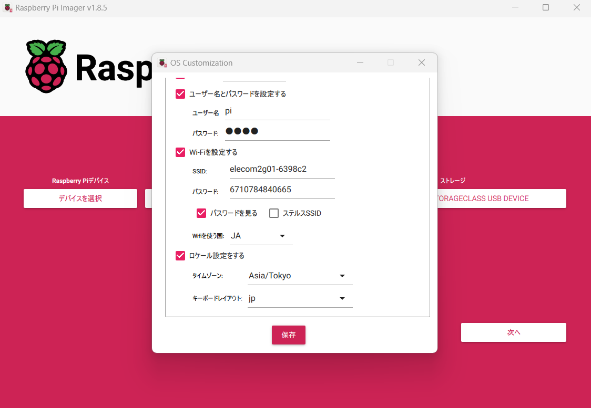

- SSHを有効化します。
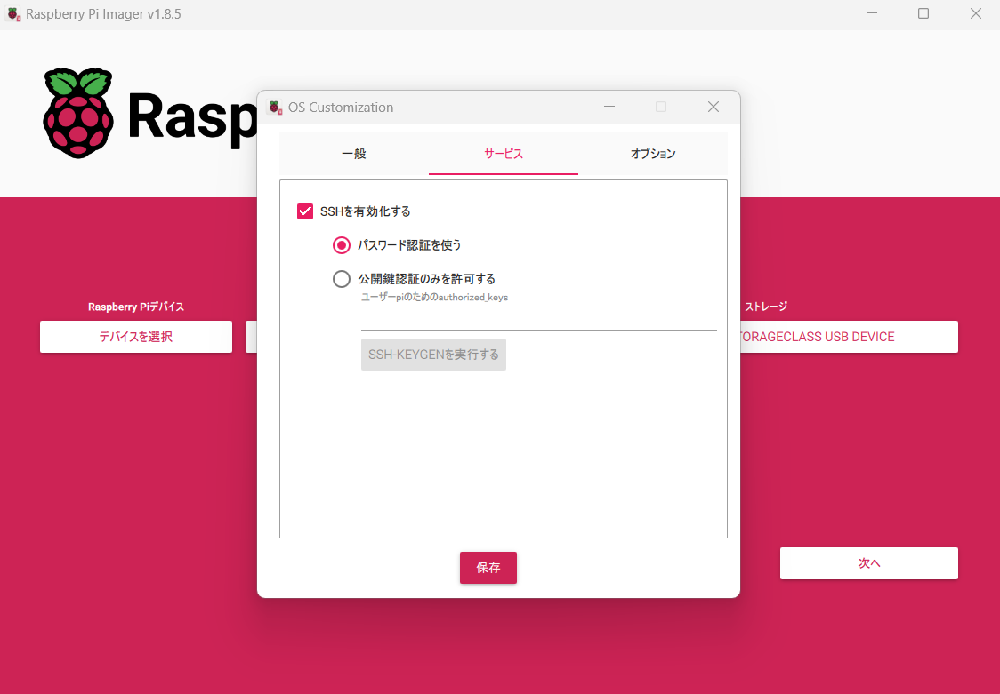

- 設定が入力できたら、保存をクリックします。
- OSにRaspberry Pi  OS (32-bit)を選択、ストレージにmicroSDカードを選択して、次へをクリックします。
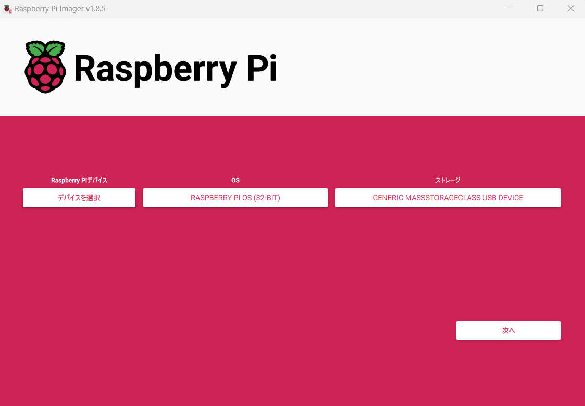

- 下記のような画面が表示されるので、「はい」をクリックします。
- 書き込みには数分かかるので気長に待ちましょう。
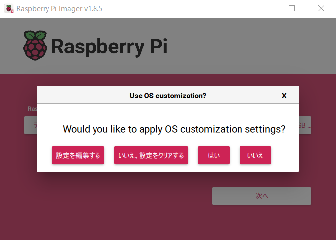

### 上記の手順でSSHに接続できない場合
- microSDカードをノートPCに接続し、bootfsの直下に「ssh」ファイルを配置します。
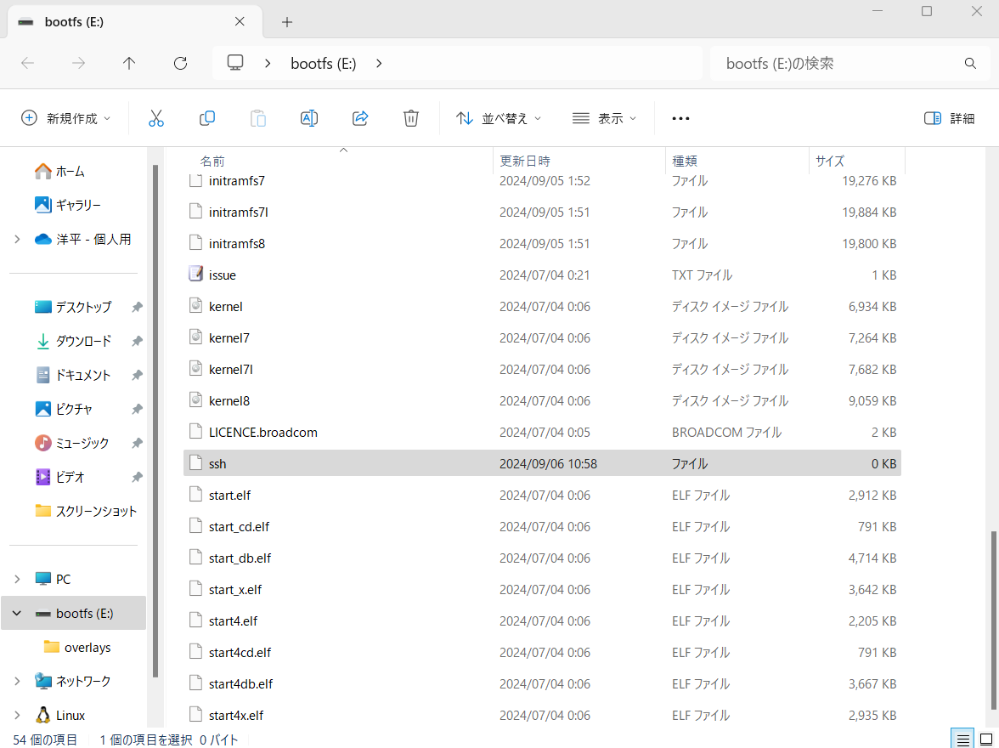

- SSHファイルをGUIで作成すると、2回目以降のSSH接続で作成したsshファイルが消えてしまう不具合があります。
- PowerShellを起動して、次のコマンドを使用して、sshファイルを作成します。
```ps
New-Item -Path . -Name "ssh" -ItemType "file" ## Create ssh file
ls                                            ## Check for ssh files
```

## Tera Termのインストール
- Raspberry Pi 4とノートPCをSSH接続するために、ノートPCにTera Termをインストールします。
- 本説明では、Tera Term v4.108を使用しています。
https://forest.watch.impress.co.jp/library/software/utf8teraterm/

## Raspberry Pi 4にmicroSDカードを装着
- Raspberry Pi 4に、microSDカードを装着します（裏に差し込み口があります）。
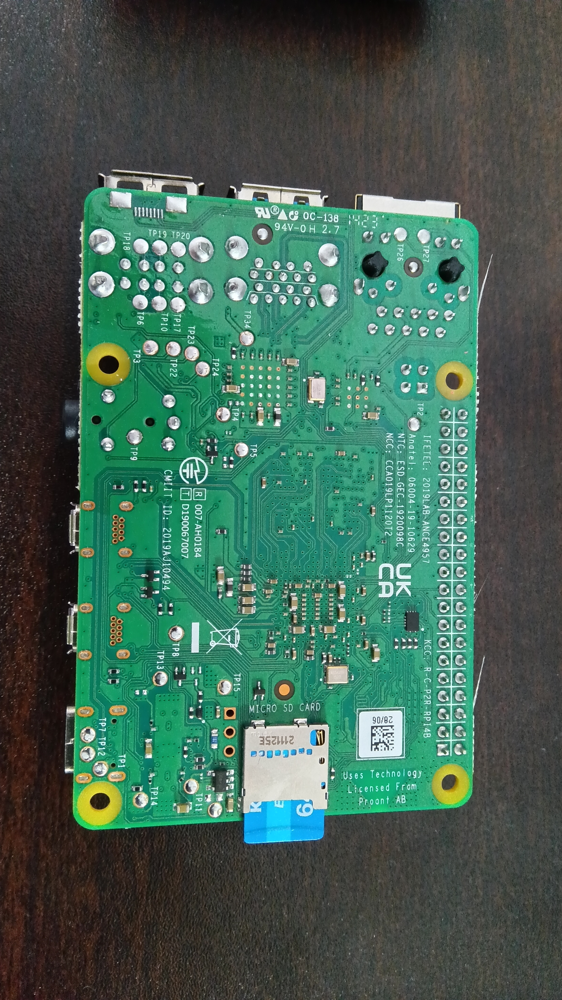

- モバイルバッテリーを接続すると、Raspberry Pi 4の電源が入ります（赤色で点灯します）。
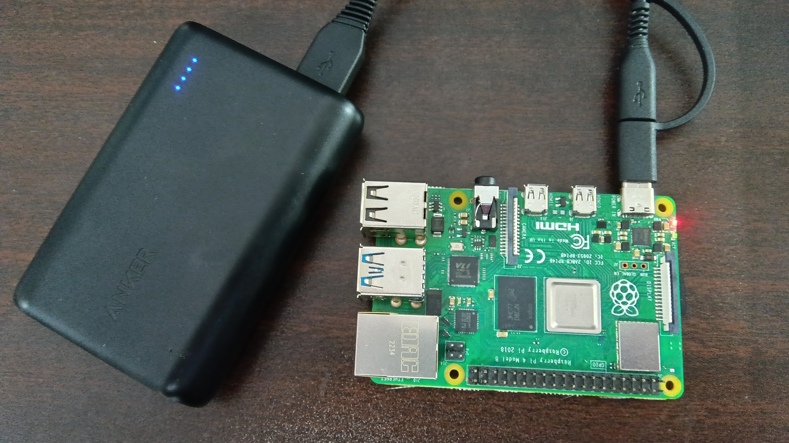

## Tera Termで接続を確認
- Tera Termを起動して、ホスト名を入力して、OKをクリックします。
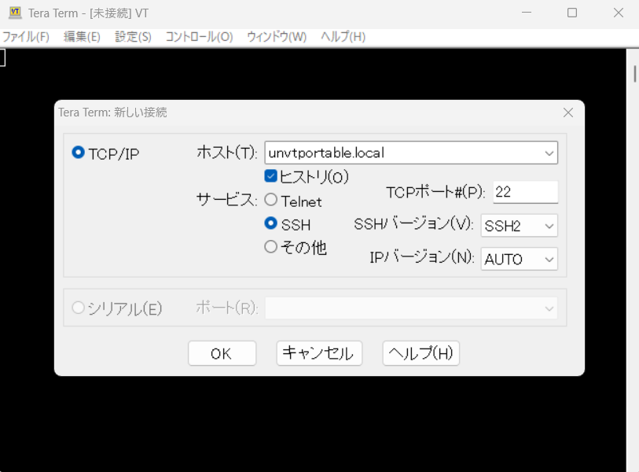

- Wi-Fiに接続されると下記のような画面が表示されます。
- Wi-Fiの接続には時間がかかる場合があるので気長に待ちましょう。
- ユーザ名「pi」と設定したパスワードを入力して、OKをクリックします。
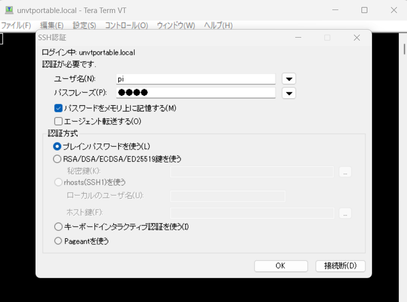

- 下記のような画面が表示されれば、Raspberry Pi 4とノートPCの接続が完了しています。
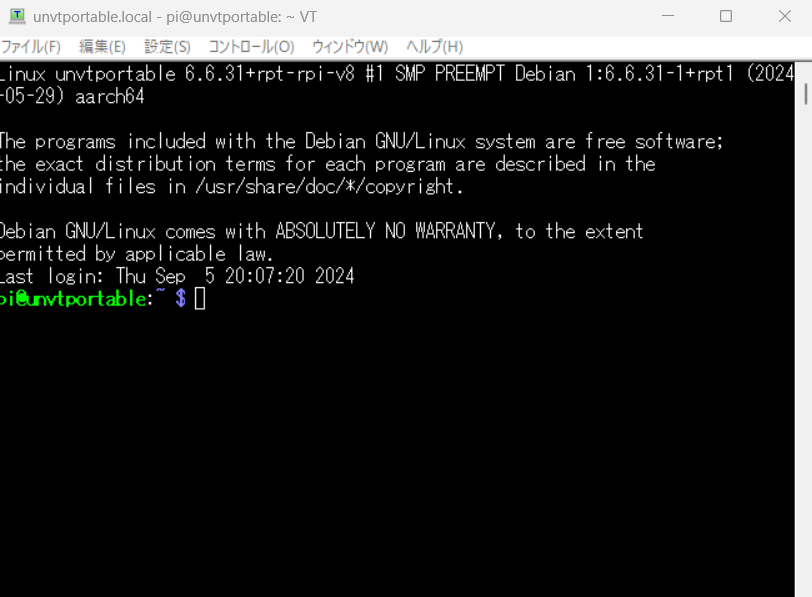

# Raspberry Piのセットアップ
- Raspberry Pi 4を自宅のWi-Fiネットワークに接続しながら、Raspberry Pi 4自身がWi-Fiアクセスポイントになるようにセットアップを行います。
- 構成図は参考記事「[Raspberry Pi WiFiアクセスポイント+クライアント同時使用](https://www.mikan-tech.net/entry/raspi-wifi-ap-sta)」を参照してください。

## ネットワーク構成
### Wi-Fiクライアント機能
- Wi-Fiクライアント機能で自宅のWi-Fiネットワークに接続します。
- こちらは「microSDカードにRaspberry Pi OS(32bit)を書き込む」際にWi-Fiを設定済みです。

### Wi-Fiアクセスポイント機能
- Wi-Fiアクセスポイント機能のSSIDを「UNVTPortable」、パスワードは任意の値（hostapd.conf の wpa_passphrase）とします。 
- また、アクセスポイント側のIPアドレスは192.168.249.1にしました。
- 接続しに来るスマートフォンやノートPCにIPアドレスを配布するためにアクセスポイント側にDHCPサーバー機能ももたせます。 

## 各種ソフトウェアのインストール
- ウェブサーバーソフトウェアであるapatch2、ソフトウェアアクセスポイント機能を実現するhostapd、 DNSフォワーダー＆DHCPサーバー機能を持つdnsmasqを使用します。
- ここでは、Raspberry Pi 4を自宅のWi-Fiネットワークに繋いだ状態で作業しました。 
- ただ、Wi-Fi設定をいじるのを間違えるとWi-Fiが切れてしまう可能性もあるので、有線LANで作業したほうがいいかもしれません。

## 仮想Wi-Fiインターフェースの作成
- Raspberry Pi 4はデフォルトのWi-Fiインターフェースとして`wlan0`があります。
- `iw dev`コマンドで見ると、Wi-Fi物理デバイスに`wlan0`というインターフェースが割り当てられていることがわかります。
- `ssid`を見ると、自宅のWi-Fiネットワークと繋がっていることが確認できます。

```
pi@unvtportable:~ $ iw dev
phy#0
        Unnamed/non-netdev interface
                wdev 0x3
                addr XX:XX:XX:XX:XX:XX
                type P2P-device
                txpower 31.00 dBm
        Interface wlan0
                ifindex 3
                wdev 0x1
                addr XX:XX:XX:XX:XX:XX
                ssid YOUR_WIFI_SSID
                type managed
                channel 7 (2442 MHz), width: 20 MHz, center1: 2442 MHz
                txpower 31.00 dBm
```

- `wlan0`は自宅のWi-Fiネットワークに繋いだまま、もう1つ仮想Wi-Fiインターフェースを作成してそちらをWi-Fiのアクセスポイントとして使います。
```
sudo iw phy phy0 interface add ap0 type __ap
sudo ip link set ap0 address XX:XX:XX:XX:XX:XX
```
- 1行目でap0という名前の仮想インターフェースを作成しました。
- 2行目でap0のMACアドレスを設定します。 
- MACアドレスはwlan0と同じでよいでしょう。
- 結果を見てみましょう。
```
pi@unvtportable:~ $ iw dev
phy#0
        Unnamed/non-netdev interface
                wdev 0x3
                addr XX:XX:XX:XX:XX:XX
                type P2P-device
                txpower 31.00 dBm
        Interface ap0
                ifindex 4
                wdev 0x2
                addr XX:XX:XX:XX:XX:XX
                type AP
                channel 7 (2442 MHz), width: 20 MHz, center1: 2442 MHz
                txpower 31.00 dBm
        Interface wlan0
                ifindex 3
                wdev 0x1
                addr XX:XX:XX:XX:XX:XX
                ssid YOUR_WIFI_SSID
                type managed
                channel 7 (2442 MHz), width: 20 MHz, center1: 2442 MHz
                txpower 31.00 dBm
```
- `wlan0`に加え、`ap0`というインターフェースができました。
- `wlan0`はこれまで通りクライアントに、`ap0`をアクセスポイントとしてセットアップしていきます。

## udevの設定
- Wi-FiインターフェースはRaspberry Pi 4を再起動すると元に戻り、ap0は消えてしまいます。
-  再起動後もap0が使えるように、起動時にap0を作成するよう設定しましょう。
- udevの仕組みを使います。`/etc/udev/rules.d/99-ap0.rules`というファイルを作成します
- 例えばnanoを使うなら次の通りにします。
```
sudo nano /etc/udev/rules.d/99-ap0.rules
```
- ファイルの中身は次の通りにします。
```
SUBSYSTEM=="ieee80211", ACTION=="add|change", ATTR{macaddress}=="XX:XX:XX:XX:XX:XX", KERNEL=="phy0", \
  RUN+="/sbin/iw phy phy0 interface add ap0 type __ap", \
  RUN+="/bin/ip link set ap0 address XX:XX:XX:XX:XX:XX"
```
- なお上記MACアドレスの値は`iw dev`の結果を見てお使いのRaspberry Pi 4に合わせて変えてください。
-  これをそのままコピペしても動かないので注意！🙅‍♀️
- これでRaspberry Pi 4の起動時にudevが自動的にap0を作ります。

## Apatch2のインストール
```
sudo apt install -y apache2
```
## hostapdとdnsmasqのインストール
```
sudo apt install hostapd dnsmasq
```
## DHCPサーバーの設定(dnsmasq)
- dnsmasqの設定ファイル/etc/dnsmasq.confを編集します。
- 例えばnanoで編集するには次のようにします。
```
sudo nano /etc/dnsmasq.conf
```
- DHCPで配布するアドレスは192.168.249.50～192.168.249.150にしました。
```
interface=ap0
dhcp-range=192.168.249.50,192.168.249.150,255.255.255.0,12h
```
- 先ほど作成した仮想インターフェースap0でdnsmasqのDHCPサーバー機能が有効になります。
- Wi-Fiクライアント側(wlan0)や有線LAN(eth0)には影響しませんのでご安心ください。

## DHCPクライアントの設定(dhcpcd)
- 続いて、自分自身のIPアドレスを固定するために、/etc/dhcpcd.confを編集します。
- このファイルはDHCPクライアント機能の設定ファイルです。
```
sudo nano /etc/dhcpcd.conf
```
- ファイルの最後に以下の3行を追加しましょう。
```
interface ap0
static ip_address=192.168.249.1/24
nohook wpa_supplicant
```
- これでアクセスポイント側(ap0)のIPアドレを192.168.249.1に固定します。
- なお、Wi-Fiクライアント側(wlan0)や有線LAN(eth0)はこれまで通りDHCPが使えます。

## hostapdの設定
- 続いて、hostapdの設定を行います。
- 設定ファイルは自動では生成されないようです。 
- 自分で/etc/hostapd/hostapd.confというファイルを作成しましょう。
- 例えばnanoだと、次のコマンドです。
```
sudo nano /etc/hostapd/hostapd.conf
```
- ファイルの内容は次のようにします。
```
ctrl_interface=/var/run/hostapd
ctrl_interface_group=0
interface=ap0
driver=nl80211
ssid=UNVTPortable
hw_mode=g
country_code=JP
channel=11
ieee80211d=1
wmm_enabled=1
macaddr_acl=0
auth_algs=1
wpa=2
wpa_passphrase=CHANGE_ME
wpa_key_mgmt=WPA-PSK
rsn_pairwise=CCMP
ignore_broadcast_ssid=0
```
- hw_mode=gとしていますが、これは2.4GHz帯のIEEE802.11gの通信方式を指定しています。
- channel=11で11chを使っていますが、1～13chが使えます。
- また、hw_mode=aとすると、5GHz帯のIEEE802.11aが使えますが、法規制上レーダーとの干渉を防ぐための機能を有効にする必要があるなど 設定を見直す必要があります。
- なお、hw_modeを変えた場合はchannelも5GHz帯のものに合わせて変える必要があります
- ssidの行とwpa_passphraseの行は自分のSSIDやパスワードにあわせて変えてください。
- hostapdはaptでインストールしても自動では有効になりません。
- 以下のコマンドで起動時に自動でhostapdが立ち上がるように設定しましょう。
```
sudo systemctl unmask hostapd.service
sudo systemctl enable hostapd.service
```

 ## Wi-Fiの有効化
- Raspberry Pi 4のインストール直後はWi-Fiが無効になっています。 
- 国ごとに電波の規制が異なるので、国コードを設定するまでは電波を出さないためだと思います。
- 私はここまで自宅のWi-Fi経由で作業してきましたが、有線LAN経由で作業していてまだWi-Fiを有効にしていない方は、Wi-Fiを有効化しましょう。
- /etc/wpa_supplicant/wpa_supplicant.confを編集します。
```
sudo nano /etc/wpa_supplicant/wpa_supplicant.conf
```
- このファイルを次のようにします。
- networkで自宅のWi-Fiを指定しないと、再起動した際に、ap0のほうに自宅のWi-Fiネットワークが繋がってしまうようです。
```
ctrl_interface=DIR=/var/run/wpa_supplicant GROUP=netdev
update_config=1
p2p_disabled=1
country=JP
network={
    ssid="YOUR_WIFI_SSID"
    psk="YOUR_WIFI_PASSWORD"
    key_mgmt=WPA-PSK
}
```
- ファイルを保存後、次のコマンドでWi-Fiを有効にします。
```
sudo rfkill unblock wifi
```
- これでWi-Fiが有効になります。
- 別のWi-Fiを切り替える方法です。
- 現在のWi-Fi接続を切断します。
```
sudo nmcli dev disconnect wlan0
```
- 例えば、`wlan0`をスマホのテザリングに接続します。
```
sudo nmcli dev wifi connect 'テザリングSSID' password 'テザリングのパスワード' ifname wlan0
```
- 接続を確認します。
```
iw dev
```
- 再起動後に自動接続するように`wpa_supplicant`を設定します。
```
sudo nano /etc/wpa_supplicant/wpa_supplicant.conf
```
- wpa_supplicant.conf ファイルを編集します。
```
ctrl_interface=DIR=/var/run/wpa_supplicant GROUP=netdev
update_config=1
p2p_disabled=1
country=JP
network={
    ssid="スマホのテザリングSSID"
    psk="スマホのテザリングパスワード"
    key_mgmt=WPA-PSK
}
```
- 設定を再起動して、自動接続を確認します。
```
sudo systemctl restart wpa_supplicant
sudo reboot
iw dev
```
## 動作確認の準備
- 動作確認のときに分かりやすいので、WebサーバーのNginxをインストールします。
- ブラウザでアクセスすると、Nginxのデフォルトページが見えます。
```
sudo apt install nginx
```

## 設定ファイルの反映
設定したhostapd、dnsmasq、dhcpcdを再起動しましょう。
```
sudo systemctl restart dhcpcd.service
sudo systemctl restart hostapd.service
sudo systemctl restart dnsmasq.service
```
- これでWi-Fiアクセスポイント機能が起動します。
- ノートPCやスマートフォンからWi-Fiアクセスポイントを探してみます。
- Wi-Fiアクセスポイント「UNVTPortable」というSSIDが表示されればOKです。
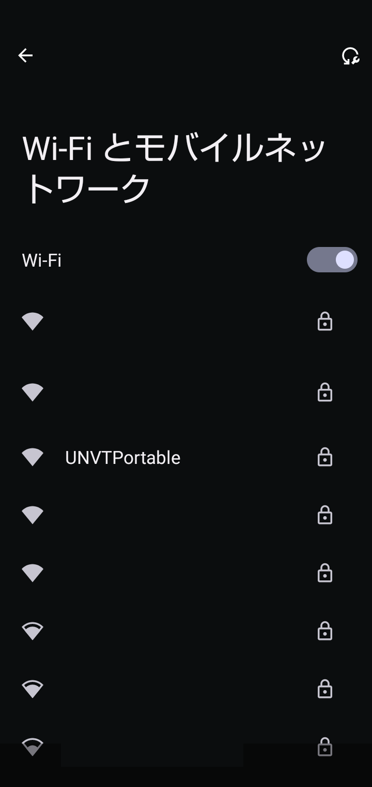

- パスワードを入力すると接続できます。
- インターネットに接続されていません、という表示になります。
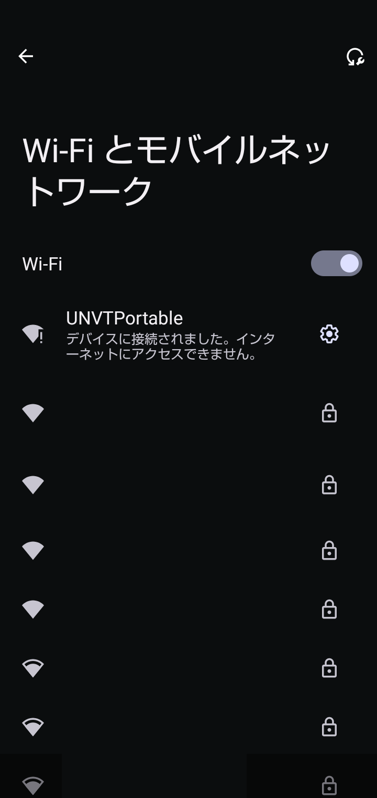

- Raspberry Pi 4は自宅のWi-Fiに接続していますが、Raspberry Pi 4のアクセスポイントは自宅のWi-Fiネットワークとは独立しており、 ここから直接自宅のネットワークに入ったり、インターネットにアクセスすることはできません。

- 接続できれば、ブラウザでhttp://192.168.249.1/ でアクセスできます。

# Raspberry PiでホスティングしたいデータをFTP転送
## /var/www のパーミッションを 744 に変更
- SSH経由でRaspberry Pi 4にアクセスし、権限を変更します。
- 権限を変更しないと、外部からファイルにアクセスできなくなります。
```
cd /var/www
pi@unvtportable:/var/www $ sudo chmod 744 -R .
pi@unvtportable:/var/www $ ls -al
```
## FTPクライアントソフトウェアのダウンロード
- Cyberduckが使用して、ホスティングしたいデータをRaspberry Pi 4に転送します。
https://cyberduck.softonic.jp/
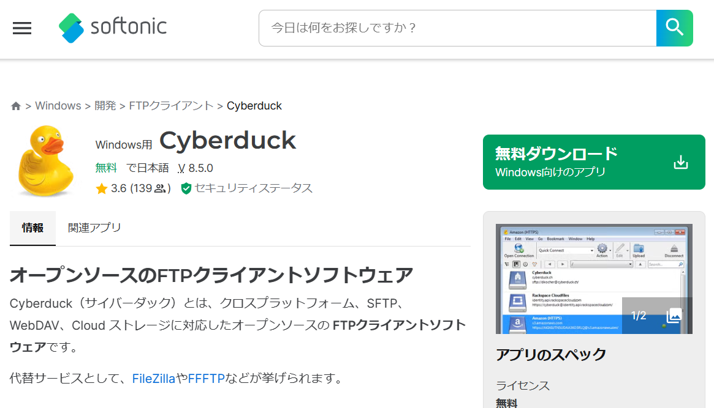

## CyberduckによるSFTPデータ転送
- Cyberduckを起動し、Raspberry Pi 4に接続します。
- Cyberduckを使用してSFTP(ポート22)経由でunvtportable.localに接続します。
- 次のように設定します。 
サーバ：unvtportable.local
アカウント：pi
パスワード：（設定したパスワード）
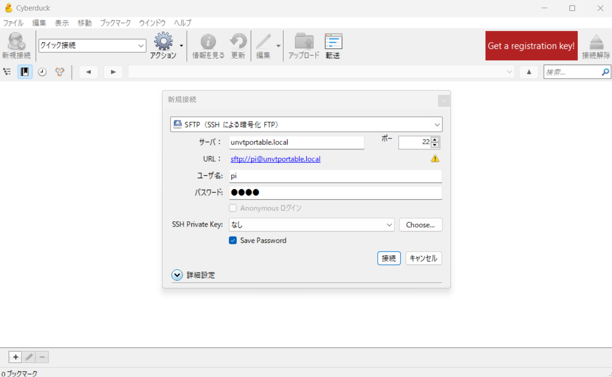

## Raspberry Pi 4にホスティングファイルを転送する
- 本リポジトリの `html` フォルダ内のフォルダとファイルをそのまま転送します。
- ファイルの転送場所：`/var/www/html`
- `html/public` には、次の3つのデータを別途格納してください（リポジトリには含まれていません。入手先は README を参照）。
    - `optimal_bvmap-v1.pmtiles`（国土地理院 最適化ベクトルタイル）
    - `PLATEAU_2023_LOD0.pmtiles`（PLATEAU 建築物モデル LOD0）
    - `gsi-dem-terrain-rgb/`（国土地理院 標高タイル、zip を展開したフォルダ）
- ファイルの転送には時間がかかります。
- 転送するファイルの構成は以下のとおりです。
```
html
│  index.html
├─glyphs
│  ├─NotoSansJP-Regular
│  ├─NotoSerifJP-Medium
│  └─NotoSerifJP-SemiBold
├─lib
│  ├─maplibre-gl@4.5.0
│  └─pmtiles@2.11.0
├─public
│  │  optimal_bvmap-v1.pmtiles
│  │  PLATEAU_2023_LOD0.pmtiles
│  └─gsi-dem-terrain-rgb
│      └─{z}/{x}/{y}.png
├─sprite
└─style
        std.json
```

- ノートPCまたはスマートフォンのブラウザでhttp://192.168.249.1/ にアクセスするとマップ（最適化ベクトルタイル）が表示されます。

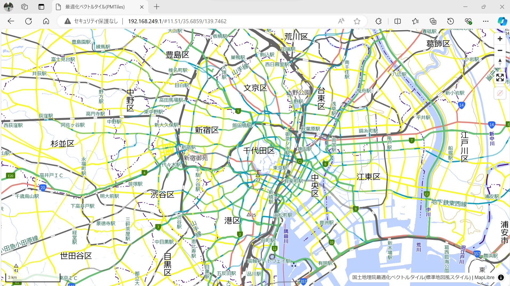

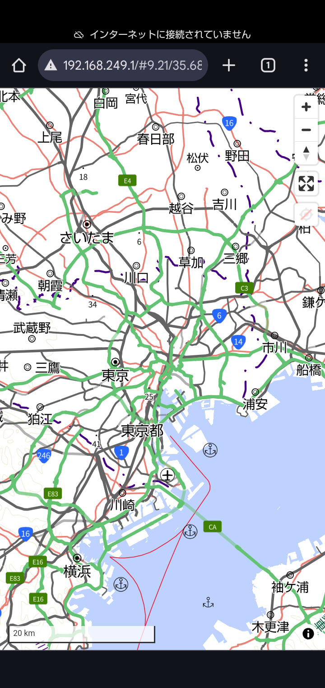

- 以上で説明は終わりです。お疲れ様でした。
